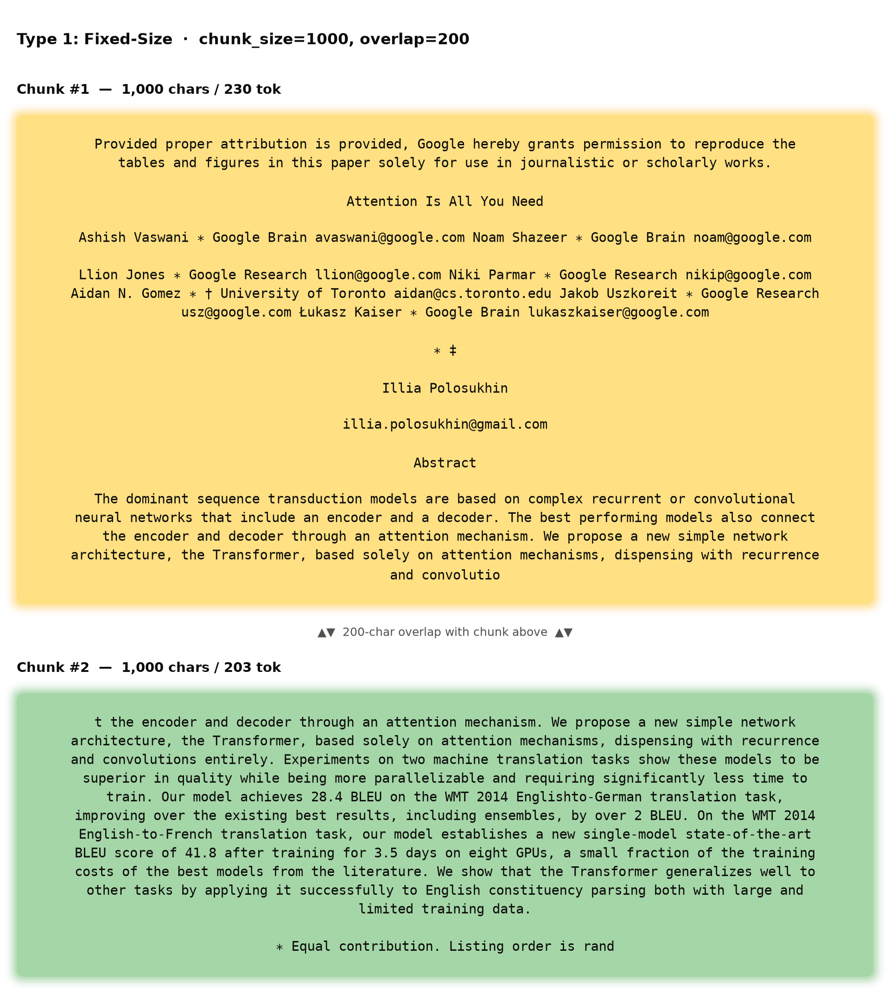
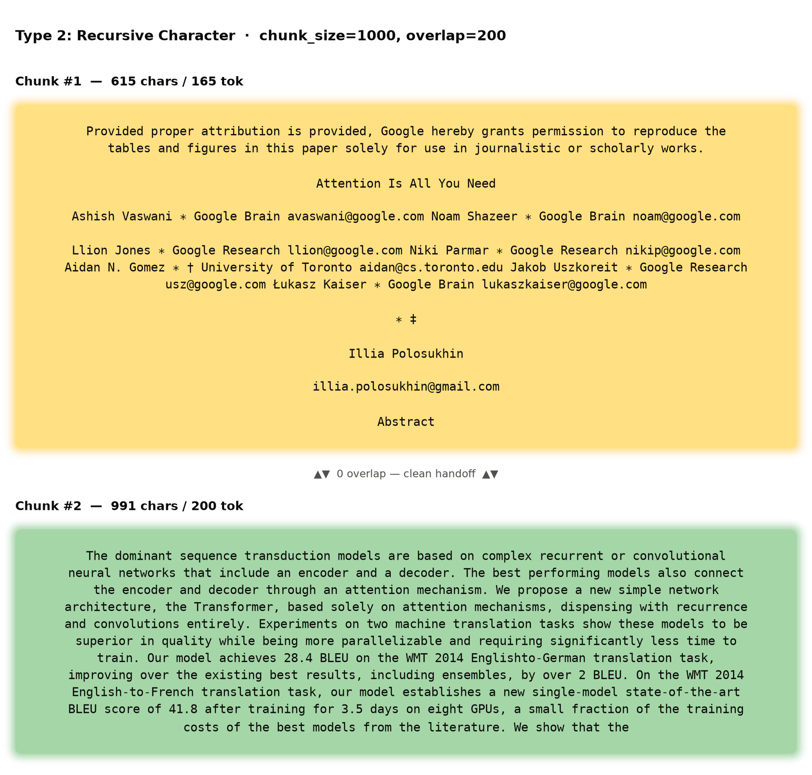
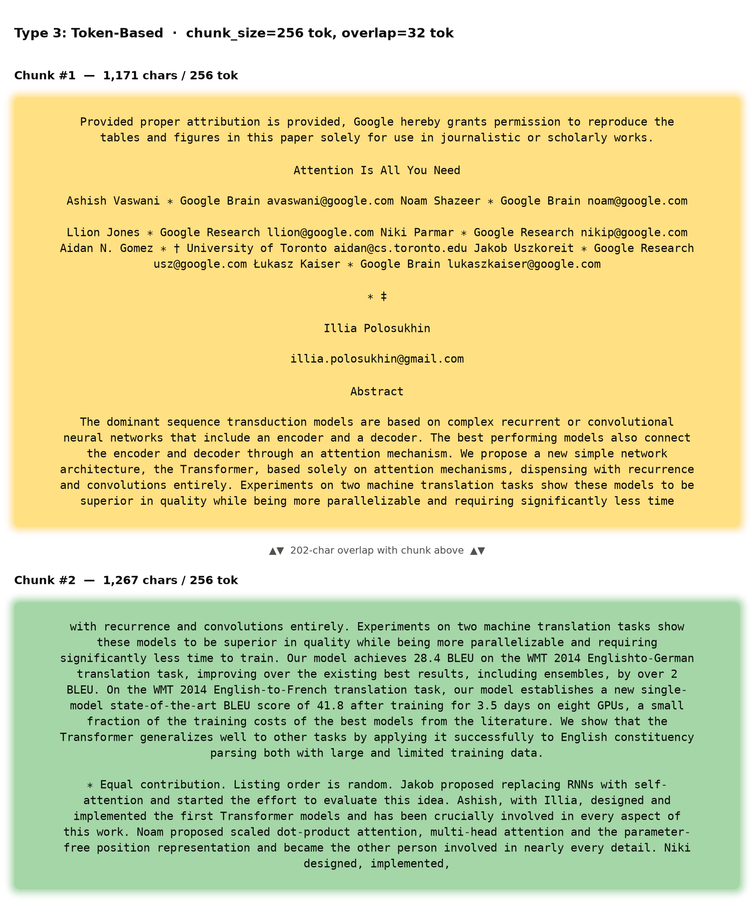
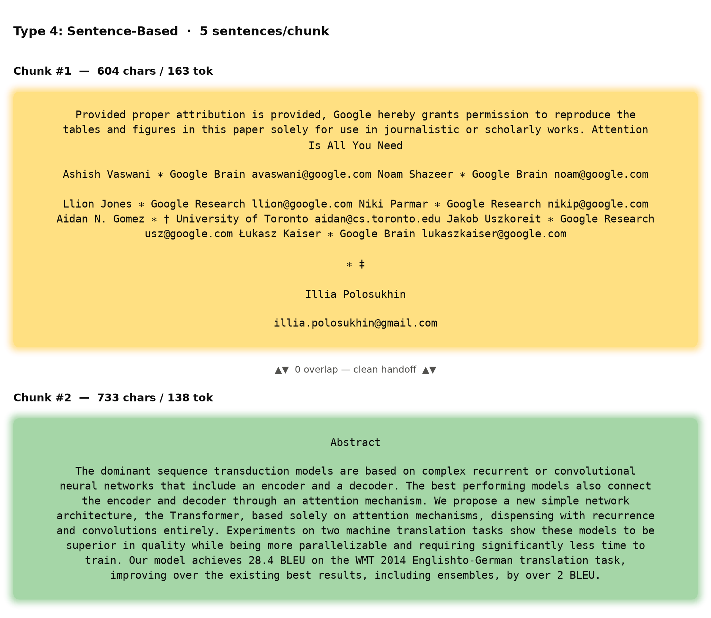
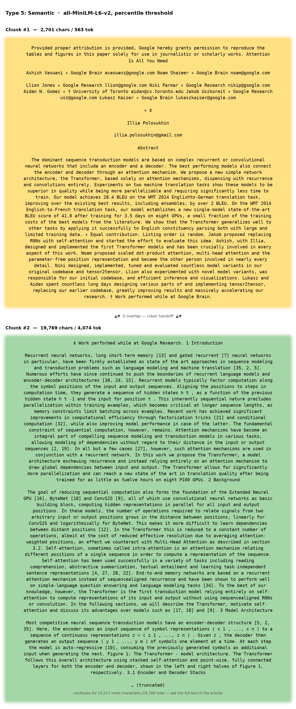
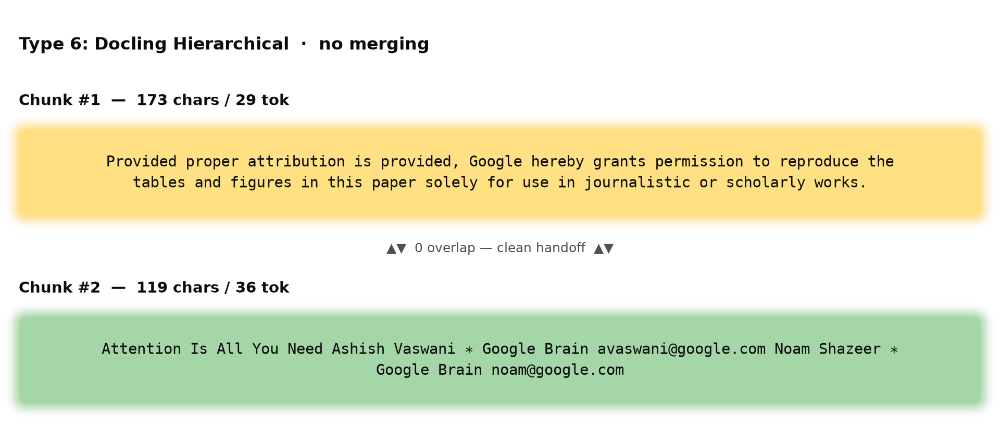
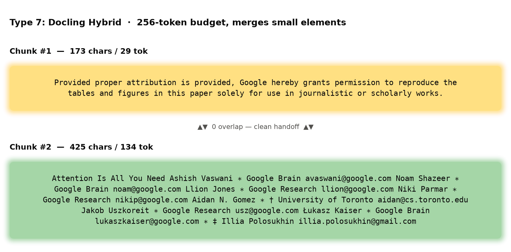

# RAG_chunking_implementation_tutorial
This repository shows how to implement different chunking strategies needed for RAG to understand the fundamentals better.

# Chunking in RAG: 7 Techniques, Tested on "Attention Is All You Need"

## What is chunking in a RAG pipeline?

A RAG (Retrieval-Augmented Generation) system can't embed and search an entire document as one block that embedding models have a token limit, and stuffing a whole 15-page paper into one vector would blur every distinct idea in the paper into a single, mushy representation. **Chunking** is the step where a parsed document gets split into smaller pieces *before* embedding, so that:

- each chunk is small enough to fit an embedding model's context window,
- each chunk is (ideally) coherent enough to represent one idea, so retrieval returns something the LLM can actually use,
- retrieval can be precise, pulling back the 2-3 chunks that matter instead of 15 pages of noise.

Every chunking technique below answers the same question differently: **where should the cuts go?** We parsed the Transformer paper once with [docling](https://github.com/docling-project/docling) and ran the same text through 7 different chunkers.

For a true apples-to-apples comparison, every technique below is shown as **chunk #1 followed by chunk #2, both starting from the exact same sentence** (the paper's copyright line). Looking at only one chunk in isolation hides *why* techniques diverge, showing the pair makes the mechanism visible: you can see exactly where chunk #1 stops, where chunk #2 picks up, and whether anything gets repeated (overlap) or dropped in between.

---

## Type 1: Fixed-Size Chunking

**What it is**: Slide a fixed-width window (e.g. 1000 characters) across the raw text with a fixed overlap (e.g. 200 characters), with zero awareness of sentences, paragraphs, or structure. It's pure arithmetic on string length.

**The walk**: the 200-character overlap is real and verbatim here. Chunk #2 opens with "t the encoder and decoder through an attention mechanism...convolutio", which is a character-for-character repeat of the tail end of chunk #1 ("...also connec-**t the encoder**..."). Both chunks cut mid-word, and so does the *overlap itself* It doesn't snap to a word boundary, it's just "the last 200 characters," full stop. Chunk #2 also runs straight through the rest of the Abstract and into an unrelated author-contribution footnote before hitting its own 1000-character limit.

**Pros**
- Trivial to implement, zero dependencies, completely predictable size.
- Fast, no parsing, no model calls.

**Cons**
- Cuts sentences and even words in half at both ends of a chunk, and the overlap itself inherits the same mid-word sloppiness.
- No structural awareness at all content, headings, and boilerplate are all just characters to it.

**When to use**: quick prototypes, logs or unstructured text with no real sentence structure, or when you need a guaranteed-uniform chunk size and will tune overlap to compensate.
**When not to use**: any document where sentence/paragraph boundaries carry meaning which is most real-world text, including this paper.

---

## Type 2: Recursive Character Chunking

**What it is**: LangChain's `RecursiveCharacterTextSplitter`. It still targets a fixed size, but tries a priority list of separators first, paragraph breaks, then line breaks, then spaces, only falling back to a raw character cut if nothing else fits. It's fixed-size chunking with manners.

**The walk**: this is the surprise. `chunk_overlap=200` is configured the exact same setting used for Type 1, yet there is **zero duplicated text** between these two chunks. Chunk #1 ends "...gmail.com\n\nAbstract" and chunk #2 begins immediately with "The dominant sequence...", with not one repeated character. This happens because the Abstract's body is one large paragraph that doesn't fit in the remaining space, so the splitter has to recursively break it down further using finer separators and that recursive break starts the next chunk fresh, without carrying the overlap forward from the previous merge. **`chunk_overlap` is a target the algorithm tries to hit, not a guarantee it always delivers** , worth knowing before you rely on it.

**Pros**
- Same simplicity/speed as fixed-size, but chunks land on natural boundaries (paragraphs, lines) far more often.
- One of the most widely used defaults in production RAG stacks due to well-understood behavior.

**Cons**
- Still size-driven, not meaning-driven, chunk #2 still ends mid-sentence ("We show that the") once inside a long paragraph.
- Overlap is inconsistent in practice, as shown above you can't always count on it being applied.

**When to use**: the default choice for general-purpose text chunking when you don't have (or don't want to invest in) structure- or meaning-aware chunking.
**When not to use**: highly structured documents (papers, contracts, docs with tables) where section boundaries should be preserved exactly, or pipelines that depend on overlap always being present.

---

## Type 3: Token-Based Chunking

**What it is**: Same idea as recursive chunking, but the size limit is measured in **tokens** (via `tiktoken`) instead of characters. This matters because embedding models and LLMs have token limits, not character limits "1000 characters" can be anywhere from ~150 to ~300 tokens depending on the text.

**The walk**: unlike recursive chunking, the overlap here is reliable chunk #2 opens with "with recurrence and convolutions entirely. Experiments on two machine translation tasks..." which is a verbatim repeat of chunk #1's tail. That's because token-based splitting works directly off the flat character stream (re-sliced by token position), not a paragraph-aware merge, so there's no recursive step that can drop it. Chunk #2 then runs through the *entire* rest of the Abstract plus the *entire* author-contribution footnote before stopping mid-sentence on "Niki designed, implemented,".

**Pros**
- Chunk sizes map directly to what actually matters to the embedding/LLM context budget.
- The overlap behaves predictably (unlike Type 2), because there's no recursive re-splitting step to disrupt it.

**Cons**
- Requires a tokenizer that matches your embedding model, or the counts are an approximation.
- Zero boundary awareness this chunk crosses straight from the Abstract into an unrelated footnote without noticing.

**When to use**: any pipeline where you need a hard, reliable guarantee that no chunk exceeds an embedding model's or LLM's context limit, and where overlap needs to be consistently applied.
**When not to use**: as a standalone technique when structural fidelity matters more than exact token counts.

---

## Type 4: Sentence-Based Chunking

**What it is**: Use an NLP sentence segmenter (spaCy here) to split the text into real sentences, then group a fixed number of sentences (5, in this run) into each chunk. There's no overlap parameter at all. Each chunk starts exactly where the last one's sentences ended.

**The walk**: a completely clean handoff. Chunk #1 ends on "...illia.polosukhin@gmail.com" (the last of five mis-segmented "sentences" in the header), and chunk #2 begins immediately with "Abstract" followed by five genuine, complete sentences. No duplication, no gap, no mid-word cuts anywhere, because there's no overlap concept to get inconsistent, and because real sentence boundaries (unlike the header block) are exactly what this segmenter is built to find.

**Pros**
- Never fractures a sentence every chunk is grammatically complete, for genuine prose.
- The cleanest, most predictable chunk-to-chunk handoff of all seven techniques on this pair, once past the non-prose header.

**Cons**
- Chunk *size* is unpredictable across the full paper, chunks ranged from 46 to 3266 characters, because "sentence" boundaries misfire badly on non-prose text (as chunk #1 shows).
- Grouping by a fixed sentence *count* ignores topic. 5 sentences can span two unrelated ideas just as easily as they can stay on one.

**When to use**: prose-heavy documents where grammatical completeness matters more than uniform size, and you don't need semantic grouping or overlap.
**When not to use**: documents with headers, tables, or code, the sentence segmenter mis-parses them badly, as seen in chunk #1 above.

---

## Type 5: Semantic Chunking

**What it is**: Embed each sentence with a sentence-transformer model, then measure the "distance" between consecutive sentence embeddings. Wherever that distance spikes past a threshold (a topic shift), cut a chunk. No fixed size, no overlap boundaries follow meaning.

**The walk**: chunk #1 already absorbed the whole Abstract, so chunk #2 has nothing left to overlap with, it jumps straight to "1 Introduction" and then simply never finds a strong enough semantic break for the next 19,000+ characters. Two chunks into the paper, semantic chunking has already covered more raw text than several other techniques' first ten chunks combined and swallowed five section boundaries (Introduction, Background, Model Architecture, Why Self-Attention, Training) that every other technique treats as at least somewhat distinct.

**Pros**
- When it works, it groups genuinely related ideas together regardless of length.
- Doesn't depend on a fixed size or count chunk boundaries follow the content, in principle.

**Cons**
- As chunk #2 proves directly: without a size cap, "follows the content" can mean one chunk swallows five major sections. This blows past almost every embedding model's limit and would need a second, size-based splitting pass in practice.
- Struggled on this paper's results tables elsewhere in the document table rows don't have sentence structure, so the regex-based sentence splitter misparsed them.
- Slowest and most expensive technique here needs an embedding call per sentence.
- `langchain-experimental` (where this implementation lives) is officially being sunset upstream which treats this as illustrative, not necessarily production-ready as-is.

**When to use**: long-form prose where preserving a complete argument matters more than uniform size, and you're willing to add a token-budget safety net on top.
**When not to use**: documents with tables, code, or lists, or latency/cost-sensitive pipelines and, as seen here, never without a size cap.

---

## Type 6: Docling Hierarchical Chunking

**What it is**: Instead of chunking raw text, this runs on the *parsed document object* docling produced the one that already knows "this text is a heading," "this is a table," "this is a list item." `HierarchicalChunker` emits one chunk per structural element, using the document's real layout instead of guessing from character patterns. No overlap concept, and no merging of small elements.

**The walk**: chunk #1 is the *entire* copyright notice, and chunk #2 is the title plus only the **first two of six authors**. Docling parsed each author's name/email as its own small structural element, and `HierarchicalChunker` never merges adjacent elements, it just emits one chunk per element it sees. There's no overlap to speak of, and no size-based reason for the cut between authors 2 and 3, it's purely "the parser produced a new element here." It will take five more small chunks like this just to get through the remaining four authors before the Abstract finally shows up, at chunk #7.

**Pros**
- Chunks align with the paper's actual structure, down to separating each author line, something none of the text-based techniques could see at all.
- Heading metadata travels with every chunk, valuable context to prepend before embedding or show the LLM.
- No guessing from text patterns. It uses the structure docling already extracted from the PDF.

**Cons**
- No size cap in either direction: across the full paper, chunks ranged from 10 tokens (a single author line) to 1939 tokens (a long section) nothing merges the tiny ones or splits the huge ones.
- As chunk #2 shows directly, this can produce a *lot* of very small chunks before reaching real content.

**When to use**: structured source documents where section-level retrieval and citeable headings matter, and you can add a size-capping/merging pass afterward.
**When not to use**: as a final step on its own, the tiny author-line chunks above show why you'll usually want to combine this with token-budget merging (see Type 7).

---

## Type 7: Docling Hybrid Chunking

**What it is**: Starts from the same structure-aware chunks as Type 6, then adds what hierarchical chunking is missing: it **splits** any chunk that overflows a tokenizer's max-token budget, and **merges** small adjacent chunks under the same heading so they don't stay needlessly tiny.

**The walk**: chunk #1 is identical to Type 6's the copyright notice is already tiny, so there's nothing to merge there. But chunk #2 is where the difference shows up directly: instead of stopping after two authors like the hierarchical chunker did, hybrid keeps pulling in adjacent small elements **all six authors, all six emails** because the running total (134 tokens) stays comfortably under the 256-token budget. Same starting point, same underlying structural elements, but the merge logic turns six of hierarchical's tiny chunks into one. That's why hybrid reaches the Abstract at chunk #3 instead of chunk #7.

**Pros**
- Best of both worlds: structure-aware **and** the tightest, most predictable size distribution of all 7 techniques (max_tokens 277 vs. semantic chunking's 4074).
- Heading metadata is preserved and prepended into the chunk text, giving the embedding model section context for free.
- No manual tuning of chunk_size/overlap needed as the tokenizer's own max-length drives the budget.

**Cons**
- Tied to docling's parsed document, you lose this technique entirely if your source isn't parsed through docling.
- Slightly more moving parts than a plain text splitter (tokenizer download, structure model), though this run's defaults worked with zero configuration.

**When to use**: this is the strongest default for production RAG on structured documents when you're already using docling to parse.
**When not to use**: quick one-off scripts or plain-text sources where docling's structure extraction isn't in play and fall back to Type 2 or Type 3 instead.

---

## Side-by-Side: Chunk #1 → Chunk #2, Seven Ways

Same starting sentence, same pair of chunks compared directly. This is the apples-to-apples view:

| Technique | Chunk #1 | Chunk #2 | What connects them |
|---|---|---|---|
| Fixed-size | 1000 chars / 230 tok | 1000 chars / 203 tok | ~200-char verbatim overlap; both chunks cut mid-word |
| Recursive character | 615 chars / 165 tok | 991 chars / 200 tok | **Zero overlap** despite chunk_overlap=200 configured clean paragraph handoff |
| Token-based | 1171 chars / 256 tok | 1267 chars / 256 tok | ~32-token verbatim overlap, reliably applied |
| Sentence-based | 604 chars / 163 tok | 733 chars / 138 tok | No overlap parameter, clean sentence-boundary handoff |
| Semantic | 2701 chars / 563 tok | 19,769 chars / 4074 tok | No overlap concept, chunk #2 alone spans 5 sections |
| Docling hierarchical | 173 chars / 29 tok | 119 chars / 36 tok | No overlap, one tiny structural element per chunk, no merging |
| Docling hybrid | 173 chars / 29 tok | 425 chars / 134 tok | No overlap but merges several small elements up to the token budget |

## Full-Document Comparison

Same paper, parsed once with docling, chunked 7 different ways , stats across *all* chunks, not just the pair above:

| Technique | # Chunks | Avg chars | Min chars | Max chars | Avg tokens | Min tokens | Max tokens |
|---|---|---|---|---|---|---|---|
| fixed_size | 61 | 996 | 773 | 1000 | 207 | 83 | 392 |
| recursive_char | 66 | 769 | 270 | 998 | 161 | 58 | 308 |
| token_based | 46 | 1211 | 192 | 2644 | 251 | 40 | 256 |
| sentence_based | 90 | 532 | 46 | 3266 | 112 | 18 | 322 |
| semantic | 21 | 2318 | 37 | 19769 | 483 | 12 | 4074 |
| docling_hierarchical | 93 | 490 | 29 | 4351 | 129 | 10 | 1939 |
| docling_hybrid | 67 | 670 | 69 | 1232 | 177 | 13 | 277 |

**The one-line takeaway**: watching chunk #1 and chunk #2 side by side shows that "overlap" isn't a single guaranteed behavior, it's reliable in token-based chunking, silently skipped in recursive-character chunking, absent by design in sentence/semantic/docling chunking, and it's the docling hybrid chunker that's the only technique here combining real document structure with a hard, predictable token budget.
